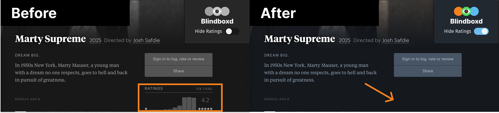

# Blindboxd

Blindboxd is a lightweight browser extension designed to hide ratings and averages on Letterboxd, helping you form unbiased opinions about movies.

Unofficial side project — not affiliated with or endorsed by Letterboxd.

## Features

- **Hide Ratings**: Easily toggle the visibility of ratings and averages on Letterboxd.
- **Persistent Settings**: Your toggle preferences are saved locally on your device.
- **Lightweight and Fast**: Designed to have minimal impact on browser performance.
- **User-Friendly Interface**: Simple and intuitive design for all users.

## How to Install

1. Clone the repo
2. Open chrome://extensions
3. Enable "Developer mode"
4. Click "Load unpacked"
5. Select the project folder

## Skills Demonstrated

- **JavaScript**: Expertise in DOM manipulation, event handling, local storage, and browser API usage.
- **CSS**: Crafting a clean and modern user interface.
- **Browser Extension Development**: Configuring manifests, content scripts, and background scripts.

## Technologies Used

- JavaScript (ES6+)
- CSS3
- HTML5
- Browser APIs

## Applications Used

- Visual Studio Code
- Figma
- ChatGPT

## Resources

The Blindboxd logo and color scheme are inspired by <a href="https://letterboxd.com/about/brand/">Letterboxd's brand guidelines</a>.

The eye in the logo is sourced from <a href="https://www.freepik.com/free-vector/illustration-eye-icon_3115228.htm#fromView=keyword&page=1&position=3&uuid=85eb93d4-14d7-4a06-9750-8a55fe23b985&query=Eye+svg>">Freepik.</a>

## TODO

- Add functionality to hide heart likes.
- Add toggle for review sections
